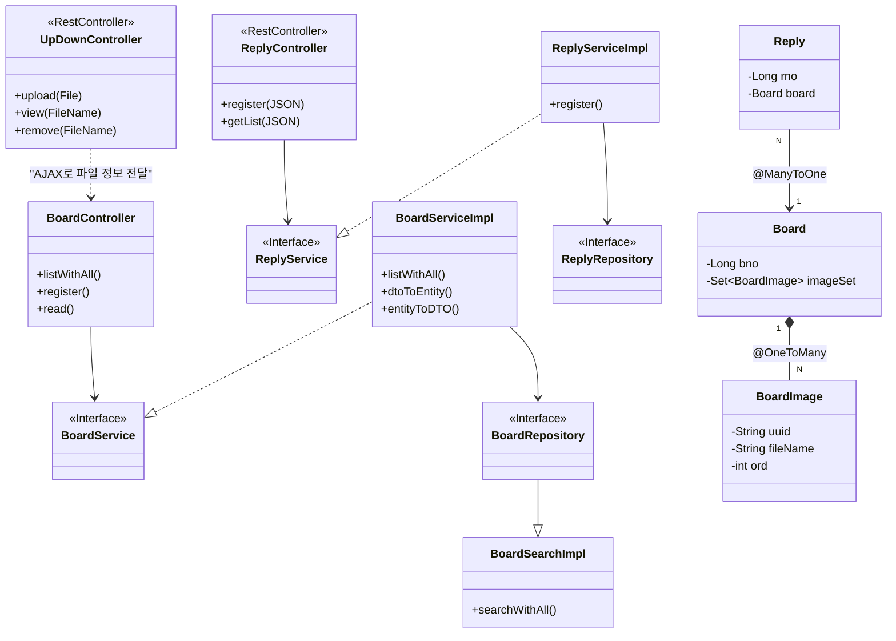

# Springboot-Data-rp-rq

```mermaid

sequenceDiagram
    autonumber
    actor User as 사용자
    participant JS as register.html (JS)
    participant FileCtrl as UpDownController
    participant BoardCtrl as BoardController
    participant Service as BoardServiceImpl
    participant DB as MariaDB
    participant Disk as HDD (C:\upload)

    %% Step 1: 파일 업로드 (선행 작업)
    Note over User, Disk: 1. 파일 업로드 (AJAX)
    User->>JS: 파일 선택 및 업로드 버튼 클릭
    JS->>FileCtrl: POST /upload (MultipartFile)
    FileCtrl->>Disk: 파일 저장 & 썸네일 생성
    FileCtrl-->>JS: 업로드 결과(UUID, FileName) 반환 (JSON)
    JS->>JS: 결과값을 <input type='hidden'> 태그로 생성

    %% Step 2: 게시글 등록 (본 작업)
    Note over User, DB: 2. 게시글 정보 + 파일 정보 전송 (Submit)
    User->>BoardCtrl: POST /board/register (Form Data)
    Note right of User: title, content, writer, <br/>fileNames[0], fileNames[1]...
    
    BoardCtrl->>Service: register(BoardDTO)
    
    activate Service
    Service->>Service: dtoToEntity(DTO)
    Note right of Service: 1. Board 엔티티 생성 <br/> 2. fileNames를 쪼개서 <br/> BoardImage 객체로 변환 <br/> 3. board.addImage()로 추가
    
    Service->>DB: boardRepository.save(board)
    activate DB
    Note right of DB: CascadeType.ALL에 의해 <br/> Board와 BoardImage가 <br/> 함께 Insert 됨
    DB-->>Service: bno 반환
    deactivate DB
    deactivate Service
    
    BoardCtrl-->>User: 목록 페이지로 Redirect
```

# 설명

다이어그램을 크게 **세 덩어리(Controller, Service, Repository)**로 나누어 흐름을 따라가 보겠습니다.

1) Controller Layer (사용자와 대화하는 창구)
BoardController: 사용자가 화면(HTML)을 요청하면 받습니다.

--> BoardService: "목록 데이터 좀 줘" 하고 서비스에게 일을 시킵니다.

ReplyController: 자바스크립트가 데이터(JSON)를 요청하면 받습니다.

--> ReplyService: "댓글 데이터 좀 줘" 하고 서비스에게 일을 시킵니다.

UpDownController: 파일 업로드/조회 요청을 받습니다.

..> BoardController: 직접 연결되진 않지만, 게시글 등록 화면에서 이 컨트롤러를 통해 파일을 먼저 올리고 그 결과(UUID)를 BoardController로 보냅니다. (AJAX 연동)

2) Service Layer (업무를 처리하는 셰프)
BoardServiceImpl: BoardService 인터페이스의 실제 구현체입니다.

..|> BoardService: 인터페이스의 약속대로 기능을 구현합니다.

--> BoardRepository: "DB에서 데이터 꺼내와" 하고 시킵니다.

DTO 변환: dtoToEntity(), entityToDTO() 같은 메서드로 재료 손질을 합니다.

ReplyServiceImpl: 댓글 관련 로직을 처리합니다.

--> ReplyRepository: 댓글 데이터를 DB에 저장하거나 조회합니다.

3) Repository Layer (데이터 창고지기)
BoardRepository: JPA가 만들어준 기본 창고입니다.

--> BoardSearchImpl: 복잡한 검색(Querydsl) 기능은 이 친구가 담당합니다. (Spring Data JPA의 사용자 정의 리포지토리 패턴)

BoardSearchImpl: Querydsl을 사용해 동적 쿼리를 만들고 **Projection(DTO 변환)**을 수행합니다.

3. Entity 관계 (데이터베이스 구조)
오른쪽의 보라색 박스들은 데이터베이스 테이블과 1:1로 매칭되는 Entity들입니다.

Board (게시글)

*-- BoardImage: 게시글 하나(1)는 여러 개의 이미지(N)를 가집니다. 다이아몬드(*)가 Board 쪽에 붙어있으므로, 게시글이 이미지를 '소유'하고 관리합니다. (게시글 지우면 이미지도 삭제됨)

Reply (댓글)

--> Board: 댓글(N)은 하나의 게시글(1)을 바라봅니다. (@ManyToOne)

💡 요약: 이 그림이 말해주는 스토리
요청: 사용자가 웹사이트에서 버튼을 누르면 Controller가 가장 먼저 받습니다.

위임: Controller는 직접 일하지 않고 Service에게 시킵니다. (-->)

구현: Service는 인터페이스 뒤에 숨겨진 ServiceImpl이 실제로 일을 합니다. (..|>)

저장/조회: Service는 Repository를 통해 DB에 접근합니다. (-->)

관계: DB 데이터 중 게시글(Board)은 이미지(BoardImage)를 강하게 소유(*--)하고 있고, 댓글(Reply)은 게시글을 단순히 참조(-->)하고 있습니다.

# 3.컨트롤러수정

```mermaid
sequenceDiagram
    autonumber
    actor User as 사용자
    participant View as register.html (JS)
    participant FileCtrl as UpDownController
    participant BoardCtrl as BoardController
    participant Service as BoardServiceImpl
    participant DB as MariaDB
    participant Disk as HDD (C:\upload)

    %% Phase 1: 파일 업로드 (선행 작업)
    rect rgb(240, 248, 255)
        Note over User, Disk: [Phase 1] 파일 업로드 (비동기 처리)
        User->>View: 1. 파일 선택 및 'Upload' 버튼 클릭
        View->>FileCtrl: 2. POST /upload (MultipartFile)
        
        activate FileCtrl
        FileCtrl->>Disk: 3. 원본 파일 및 썸네일 저장
        FileCtrl-->>View: 4. 업로드 결과 반환 (JSON: uuid, fileName...)
        deactivate FileCtrl
        
        View->>View: 5. 화면에 썸네일 출력 & <br/> <input type='hidden'> 태그 생성
    end

    %% Phase 2: 게시글 등록 (본 작업)
    rect rgb(255, 250, 240)
        Note over User, DB: [Phase 2] 게시글 정보 + 파일 정보 저장
        User->>View: 6. 제목/내용 입력 후 'Submit' 클릭
        View->>BoardCtrl: 7. POST /board/register (Form Data)
        Note right of View: title, content, writer <br/> + fileNames[0], fileNames[1]...
        
        activate BoardCtrl
        BoardCtrl->>Service: 8. register(BoardDTO)
        
        activate Service
        Service->>Service: 9. dtoToEntity() 실행
        Note right of Service: List<String> fileNames를 <br/> Set<BoardImage>로 변환하여 <br/> Board 엔티티에 addImage()
        
        Service->>DB: 10. repository.save(board)
        activate DB
        Note right of DB: CascadeType.ALL에 의해 <br/> Board INSERT 후 <br/> BoardImage들도 자동 INSERT
        DB-->>Service: bno 반환
        deactivate DB
        
        Service-->>BoardCtrl: bno 반환
        deactivate Service
        
        BoardCtrl-->>User: 11. 목록 페이지로 Redirect
        deactivate BoardCtrl
    end
```

# 3-1 설명
단계별 상세 코드 분석 (Deep Dive)
이 흐름이 코드로는 어떻게 구현되어 있는지 하나씩 매칭해 드릴게요.

🟡 Phase 1: 파일 업로드 (AJAX)
게시글 등록 버튼을 누르기 전에 일어나는 일입니다.

요청 (JS): uploadToServer(formObj)

UpDownController에게 파일을 보냅니다.

저장 (UpDownController):

transferTo(): 파일을 하드디스크에 저장합니다.

Thumbnailator: 썸네일을 만듭니다.

응답 및 처리 (JS):

서버로부터 uuid_파일명 정보를 받습니다.

핵심: 이 정보를 가지고 <input type='hidden' name='fileNames' value='...'> 태그를 동적으로 만듭니다.

이 태그가 있어야 나중에 게시글 등록할 때 파일 정보도 같이 날아갑니다.

🟢 Phase 2: 게시글 등록 (Form Submit)
사용자가 최종적으로 Submit 버튼을 눌렀을 때입니다.

요청 (BoardController):

registerPost(BoardDTO boardDTO)가 실행됩니다.

이때 boardDTO 안에는 제목, 내용뿐만 아니라 아까 몰래 만들어둔 fileNames 리스트도 들어있습니다.

변환 (BoardService - dtoToEntity):

여기가 가장 중요합니다!

DTO의 List<String> fileNames (문자열 껍데기)를

Entity의 Set<BoardImage> imageSet (알맹이 객체)으로 바꿉니다.

Java

// 문자열 쪼개기: "uuid_파일명.jpg" -> [uuid, 파일명.jpg]
String[] arr = fileName.split("_");
// 객체 생성 및 추가
board.addImage(arr[0], arr[1]);
저장 (JPA Cascade):

boardRepository.save(board)를 호출합니다.

우리는 boardImageRepository.save()를 따로 부른 적이 없지만,

CascadeType.ALL 설정 덕분에 게시글이 저장될 때 소속된 이미지들도 자동으로 DB(board_image)에 저장됩니다.

💡 멘토의 요약
이 로직의 핵심은 **"따로국밥"**입니다.

파일은 무거우니까 미리미리 하드디스크에 올려두고 (UpDownController)

게시글을 저장할 때는 파일의 **이름표(문자열)**만 가지고 와서 DB에 저장합니다. (BoardController)

이 둘을 연결해 주는 다리 역할은 자바스크립트의 <hidden> 태그와 dtoToEntity 변환 메서드가 수행합니다.
