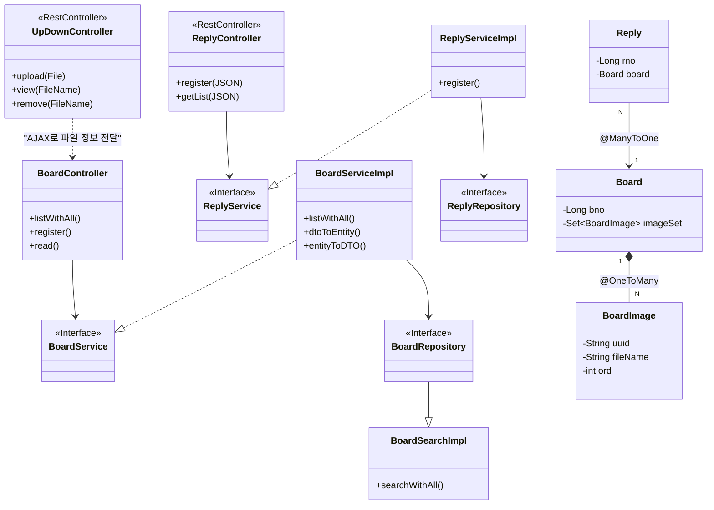

# Springboot-Data-rp-rq


```mermaid
sequenceDiagram
    autonumber
    actor User as 사용자
    participant JS as register.html (JS)
    participant FileCtrl as UpDownController
    participant BoardCtrl as BoardController
    participant Service as BoardServiceImpl
    participant DB as MariaDB
    participant Disk as HDD (C:\upload)

    %% Step 1: 파일 업로드 (선행 작업)
    Note over User, Disk: 1. 파일 업로드 (AJAX)
    User->>JS: 파일 선택 및 업로드 버튼 클릭
    JS->>FileCtrl: POST /upload (MultipartFile)
    FileCtrl->>Disk: 파일 저장 & 썸네일 생성
    FileCtrl-->>JS: 업로드 결과(UUID, FileName) 반환 (JSON)
    JS->>JS: 결과값을 <input type='hidden'> 태그로 생성

    %% Step 2: 게시글 등록 (본 작업)
    Note over User, DB: 2. 게시글 정보 + 파일 정보 전송 (Submit)
    User->>BoardCtrl: POST /board/register (Form Data)
    Note right of User: title, content, writer, <br/>fileNames[0], fileNames[1]...
    
    BoardCtrl->>Service: register(BoardDTO)
    
    activate Service
    Service->>Service: dtoToEntity(DTO)
    Note right of Service: 1. Board 엔티티 생성 <br/> 2. fileNames를 쪼개서 <br/> BoardImage 객체로 변환 <br/> 3. board.addImage()로 추가
    
    Service->>DB: boardRepository.save(board)
    activate DB
    Note right of DB: CascadeType.ALL에 의해 <br/> Board와 BoardImage가 <br/> 함께 Insert 됨
    DB-->>Service: bno 반환
    deactivate DB
    deactivate Service
    
    BoardCtrl-->>User: 목록 페이지로 Redirect

```mermaid

sequenceDiagram
    autonumber
    actor User as 사용자
    participant JS as register.html (JS)
    participant FileCtrl as UpDownController
    participant BoardCtrl as BoardController
    participant Service as BoardServiceImpl
    participant DB as MariaDB
    participant Disk as HDD (C:\upload)

    %% Step 1: 파일 업로드 (선행 작업)
    Note over User, Disk: 1. 파일 업로드 (AJAX)
    User->>JS: 파일 선택 및 업로드 버튼 클릭
    JS->>FileCtrl: POST /upload (MultipartFile)
    FileCtrl->>Disk: 파일 저장 & 썸네일 생성
    FileCtrl-->>JS: 업로드 결과(UUID, FileName) 반환 (JSON)
    JS->>JS: 결과값을 <input type='hidden'> 태그로 생성

    %% Step 2: 게시글 등록 (본 작업)
    Note over User, DB: 2. 게시글 정보 + 파일 정보 전송 (Submit)
    User->>BoardCtrl: POST /board/register (Form Data)
    Note right of User: title, content, writer, <br/>fileNames[0], fileNames[1]...
    
    BoardCtrl->>Service: register(BoardDTO)
    
    activate Service
    Service->>Service: dtoToEntity(DTO)
    Note right of Service: 1. Board 엔티티 생성 <br/> 2. fileNames를 쪼개서 <br/> BoardImage 객체로 변환 <br/> 3. board.addImage()로 추가
    
    Service->>DB: boardRepository.save(board)
    activate DB
    Note right of DB: CascadeType.ALL에 의해 <br/> Board와 BoardImage가 <br/> 함께 Insert 됨
    DB-->>Service: bno 반환
    deactivate DB
    deactivate Service
    
    BoardCtrl-->>User: 목록 페이지로 Redirect
```


# 설명

다이어그램을 크게 **세 덩어리(Controller, Service, Repository)**로 나누어 흐름을 따라가 보겠습니다.

1) Controller Layer (사용자와 대화하는 창구)
BoardController: 사용자가 화면(HTML)을 요청하면 받습니다.

--> BoardService: "목록 데이터 좀 줘" 하고 서비스에게 일을 시킵니다.

ReplyController: 자바스크립트가 데이터(JSON)를 요청하면 받습니다.

--> ReplyService: "댓글 데이터 좀 줘" 하고 서비스에게 일을 시킵니다.

UpDownController: 파일 업로드/조회 요청을 받습니다.

..> BoardController: 직접 연결되진 않지만, 게시글 등록 화면에서 이 컨트롤러를 통해 파일을 먼저 올리고 그 결과(UUID)를 BoardController로 보냅니다. (AJAX 연동)

2) Service Layer (업무를 처리하는 셰프)
BoardServiceImpl: BoardService 인터페이스의 실제 구현체입니다.

..|> BoardService: 인터페이스의 약속대로 기능을 구현합니다.

--> BoardRepository: "DB에서 데이터 꺼내와" 하고 시킵니다.

DTO 변환: dtoToEntity(), entityToDTO() 같은 메서드로 재료 손질을 합니다.

ReplyServiceImpl: 댓글 관련 로직을 처리합니다.

--> ReplyRepository: 댓글 데이터를 DB에 저장하거나 조회합니다.

3) Repository Layer (데이터 창고지기)
BoardRepository: JPA가 만들어준 기본 창고입니다.

--> BoardSearchImpl: 복잡한 검색(Querydsl) 기능은 이 친구가 담당합니다. (Spring Data JPA의 사용자 정의 리포지토리 패턴)

BoardSearchImpl: Querydsl을 사용해 동적 쿼리를 만들고 **Projection(DTO 변환)**을 수행합니다.

3. Entity 관계 (데이터베이스 구조)
오른쪽의 보라색 박스들은 데이터베이스 테이블과 1:1로 매칭되는 Entity들입니다.

Board (게시글)

*-- BoardImage: 게시글 하나(1)는 여러 개의 이미지(N)를 가집니다. 다이아몬드(*)가 Board 쪽에 붙어있으므로, 게시글이 이미지를 '소유'하고 관리합니다. (게시글 지우면 이미지도 삭제됨)

Reply (댓글)

--> Board: 댓글(N)은 하나의 게시글(1)을 바라봅니다. (@ManyToOne)

💡 요약: 이 그림이 말해주는 스토리
요청: 사용자가 웹사이트에서 버튼을 누르면 Controller가 가장 먼저 받습니다.

위임: Controller는 직접 일하지 않고 Service에게 시킵니다. (-->)

구현: Service는 인터페이스 뒤에 숨겨진 ServiceImpl이 실제로 일을 합니다. (..|>)

저장/조회: Service는 Repository를 통해 DB에 접근합니다. (-->)

관계: DB 데이터 중 게시글(Board)은 이미지(BoardImage)를 강하게 소유(*--)하고 있고, 댓글(Reply)은 게시글을 단순히 참조(-->)하고 있습니다.
